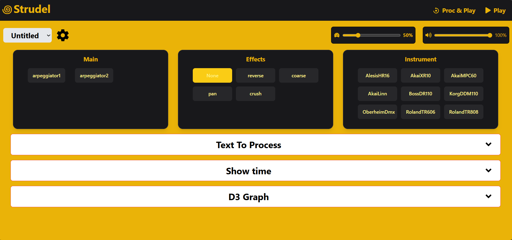
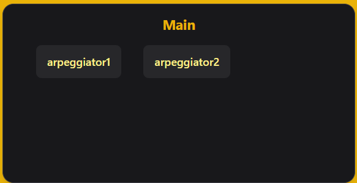
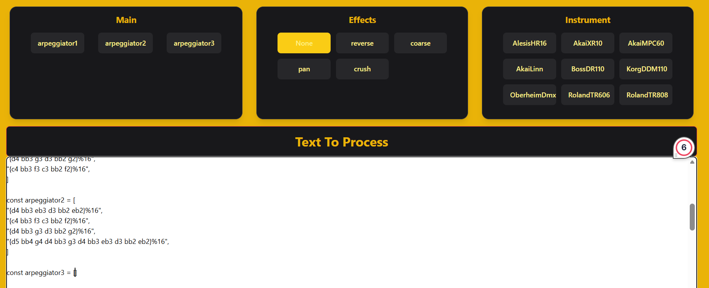
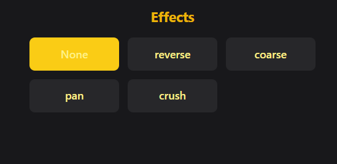
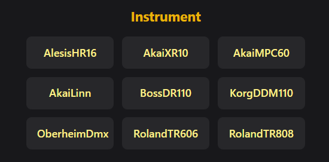
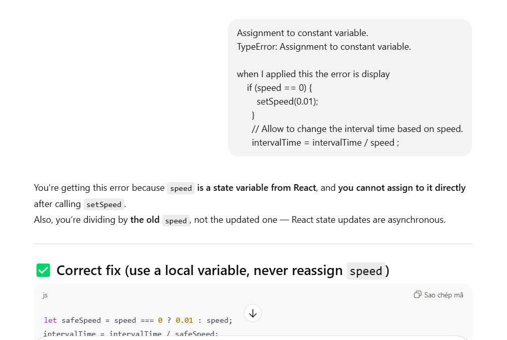
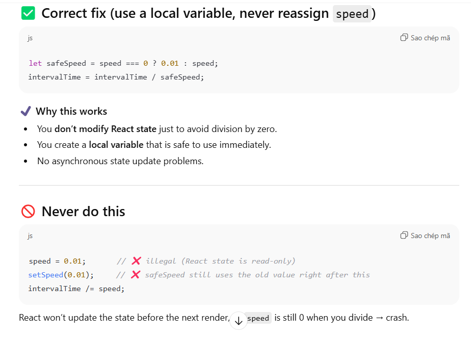

# Strudel Demo Project
## Author: Dang Khoa Nguyen - ngudy131 - 110400489

## Overview
Welcome to the `Strudel Demo Project - Assignment 2!` This project allows you to create and manipulate music using a combination of pre-defined arpeggiators, instruments, and effects. Below is a detailed guide explaining each control and how to use them effectively.

## Controls

### 1. Playback Buttons
To start interacting with your tune, you will first use the playback buttons below.

.png)  
.png)  

- **Play**: Starts music playback.  
- **Stop**: Immediately stops playback.  
- **Proc & Play**: Processes the current text/code and starts playback.  

---

### 2. Arpeggiator Selection
Selecting the right arpeggiator is key to defining your song’s character. Radio buttons allow you to switch between multiple arpeggiators, and the currently selected arpeggiator is applied to your tune immediately.  

  
 
If your text area is empty, a message will appear to prompt you to add content. Similarly, if no arpeggiators are defined in your text, another message guides you to include `const arpeggiatorX` entries.

.png)  

.png)  

Besides `const arpeggiator1` and `const arpeggiator2`, you can add more arpggiator in text and display in the main. The added arpeggiator can run if there are valid code inside it.

  
---

### 3. Effect Selection
To add more depth to your song, you can apply audio effects using the effect selection control.
- Effects are applied in real-time.  
- Selecting **None** will cancel the effect.  
 

---

### 4. Instrument Combination
This project allows you to combine multiple instruments from the instrument board to create richer sounds. Adjusting the combination updates your song in real-time, letting you hear how different instruments interact with each other.

 
---

### 5. Volume Slider
Managing volume is essential for balancing your song. The volume slider lets you adjust the output from 0 to 1, reflecting changes in both the live graph and the music output. Visual icons indicate whether the volume is high, medium, or muted, helping you understand the current output at a glance.

.png)  
.png)  
.png)  

---

### 6. Speed Slider
Control the tempo of your composition with the speed slider. Adjustments are applied immediately, allowing you to hear your song faster or slower in real-time. Visual indicators help you understand the current speed setting.

.png)  
.png)  
.png)  

---

### 7. Song selector 
The song selector allow you to view and choose any song that you have saved through the CRUD buttons including add, delete, load and save. 

### 8. CRUD Controller
The CRUD controller helps you manage your songs in local storage.

- Hidden under the settings icon; appears when clicked.  

- Functions include:  
  - **Add Song**: Add a new song to local storage; opens a modal to name and save the song.  
  - **Load Song**: Load a song from local storage.  
  - **Delete Song**: Remove a song from local storage.  
  - **Save Song**: Opens the add song modal if the song doesn’t exist yet.  
- Song selector allows the user to choose a song for saving, loading, or deletion. Duplicate names are displayed with a number indicator. Before clicking those buttons, you need to find your song in the song selector.

---

### 9. Panels / Toggles
Panels make it easier to navigate and configure your project.
  

- **Settings Panel**: Displays the song buttons manager after clicking.  

- **Show Time Panel**: Displays a real-time pianoroll visualization.  
.png)

- **Text to Process Panel**: Edit Strudel code directly.  
.png)

- **D3 Graph Panel**: Shows a live bar graph of audio gain. The picture will show in the next section 
---

### 10. Graph
- Provides a live visualization of the music output for a more engaging interface.  
- Stops updating if the song is not playing or if the volume is muted.  
- The bar heights change dynamically based on volume.  
- The intervalTime of the graph can be change dynamically based on the speed.
   
---

### 11. Alert Messages
To prevent errors and guide your workflow, the project displays alert messages when necessary. Here are some cases:
  1. Attempting to play a song with an empty text area triggers a notification. 
  .png)  

  2. Attemping to delete the text during the song is playing will trigger a notification and reload the window to avoid the errors.
  .png)

  3. Duplicate arpeggiators or selecting effects/instruments without proper text also generate alerts. 
   .png)  
   .png)  
   .png)  

These messages ensure a smooth and error-free user experience.

## Usage guidelines
When using this website to create music, please follow these guidelines for a smooth experience:

1. **Valid Strudel Code**  
   Make sure the code in the text box is valid Strudel code. Invalid code will prevent the song from playing.

2. **Text to Process**  
   Ensure the "Text to Process" textarea contains content. If it’s empty, an alert will notify you to add text after clicking the playback buttons. In addition, you must not delete the text during playing or else you will be paid off.

3. **Drums and Song Structure**  
   Avoid deleting the drums block or other essential parts of the text. To create a new drums pattern or a new song, follow the structure provided in the template.

4. **Default Arpeggiator**  
   The default arpeggiator (`arpeggiator1`) is applied automatically when playback starts.

5. **Switching Arpeggiators**  
   Use the radio buttons to switch arpeggiators during playback without stopping the music.

6. **Updating Changes**  
   If you make changes to the code but don’t notice an immediate effect, click the **Proc & Play** button to update the playback with your modifications.

7. **Deleting song**   
   Before you deleting the other song, please ensure to save the song that you are doing if it exists or add it to the local storage as the website will be reset after you delete song. Therefore, always saving or adding the song to avoid your sadness after accidently delete the song you are working.

8. **Minimum of speed**    
   The minimum of speed was set at 0.01 to avoiding the bug from the graph when 0 can make the graph run faster instead of stopping.

## Demonstrate video
Click on the link to see the Live Demo by Dang Khoa Nguyen --> [Live Demo](https://mymailunisaedu-my.sharepoint.com/my?id=%2Fpersonal%2Fngudy131%5Fmymail%5Funisa%5Fedu%5Fau%2FDocuments%2FWeb%2FAssignment%202%20%2D%20Live%20Demo%20presentation&viewid=7add51ea%2D551f%2D4509%2Db074%2D6bae0c9b8776&source=waffle)

## Song code from strudel.cc bakery
Some elements of this project use or are inspired by examples found in the Strudel.cc bakery. In particular:

- The arpeggiator patterns (`const arpeggiator1`, `const arpeggiator2`) are adapted from the bakery examples.  
- Drum and bassline patterns are influenced by the Strudel bakery’s pre-built samples.  
- Synth sounds and effects were inspired by bakery demos, though they have been customized for this project. 

## AI USAGE
During this assignment, I used AI assistance from ChatGPT to help guide my coding process and debug unknown issues, significantly reducing development time. As there will be many images in readme.md, I would like to send some examples of how ChatGPT assisted me and what code that help me to solve the problem:

### 1. Fixing Bugs
Whenever I encountered errors, I provided the error messages and relevant code to ChatGPT, which helped me identify and resolve the issues quickly.

- UpdateEditor is the function I created to allow the system update the text from the other files.
.png)

- I want to implement the speed into the graph and then, I got a problem with intervalTime like how to dealt if the speed == 0 and why I can't stop the song when the speed go to slow. The chatGPT guide me what should I do to solve those problems. 

.png)

.png)

### 2. Instrument Selection
ChatGPT guided me in implementing the instrument selection feature. Initially, I used radio buttons for selecting instruments, and later wanted to allow combining multiple instruments. ChatGPT helped me convert the inputs to checkboxes and provided guidance on detecting the drum blocks and adding the correct bank. 

.png)

.png)

.png)

.png)

.png)

### 3. Arpeggiator Selection
The arpeggiator selection functionality works correctly thanks to ChatGPT’s guidance. It helped me understand how to update the selected arpeggiator in the text dynamically.  
.png)

.png)

.png)

.png)

### 4. Code Explanation and Guidance
Some Strudel code, especially in `App.js`, was difficult to understand at first. I used ChatGPT to explain the code and guide me on how to integrate it into React, which helped me improve and adapt the code to fit the web application logic.

.png)

.png)

.png)

.png)

